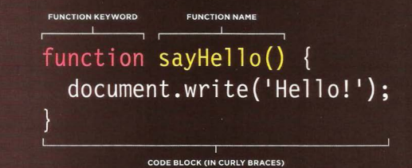

## **Java script**

is used to maked our pages interactive by accessing and modifing the content and markup used in webpage while it is being viewedin the browser, by :
## ***1- Access Content:***
### allows the user to select any element, attribute, or text from HTMLpages.
 ### You can use JavaScript to select any element, attribute, or text from anHTML page. For example:
 * Select the text inside all of the 'hl' elements on a page
 * Select any elements that have a class attribute with a value of note
 * Find out what was entered into atext input whose id attribute has a value of emai1
    
   

## ***2- Modify content***
  ### You can use JavaScript to add elements, attributes, and text to the page, or remove them. For example:
* Add a paragraph of text after the first 'hl' element
* Change the value of c1ass attributes to trigger new CSS rules for those elements
* Change the size or position of an 'img' element 

## ***3-Program Rules***
### You can specify a set of steps for the browser to follow (like a recipe), which allows it to access or change the content of a page. For example:
* A gallery script could check whichimage a user clicked on and display a larger version of that image.
* A mortgage calculator could collect values from a form, perform a calculation, and display repayments.
* An animation could check the dimensions of the browser window and move an image to the bottom of the viewable area (also known as the viewport).

#### EXAMPLES OF JAVASCRIPT IN THE BROWSER :
* SLIDESHOWS 
* Forms
* RELOAD PART OF PAGE 
* FILTERING DATA 

## ***What is  ascript?!***
### A script is a series of instructions that a computer can follow to achieve a goal. WRITING A SCRIPT To write a script:
 #### you need to first state your goal and then list the tasks that need to be completed in order to achieve it. 

### ***OPERATORS:***
### is used to allow programmers to create a single value from one or more values. 
#### **types of operators:**
| Type | Example |
| --- | ----------- |
| ASSIGNMENT OPERATORS | c = 'cat';  |
| COMPARISON OPERATORS  | num = 10 > 5;  |
|ARITHMETIC OPERATORS | Length = 10+10;|
| LOGICAL OPERATORS|s= (5 > 3) && (2 < 4);|
|STRING OPERATORS|greeting= 'Hi 1 + 'Mol ly';|

### FUNCTIONS.. 
Functions let you group a series of statements together to perform a specific task. If different parts of a script repeat the same task, you can reuse the function (rather than repeating the same set of statements). 
#### How to declare  a function?

